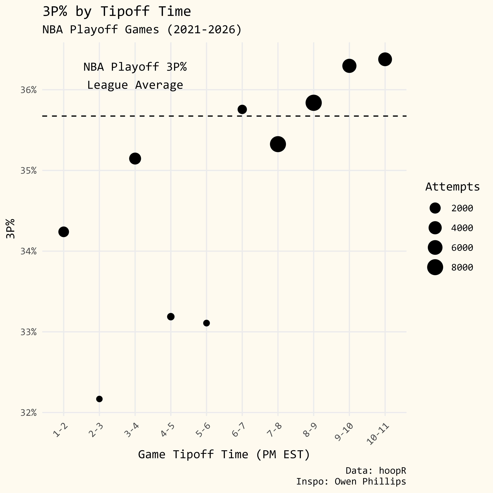
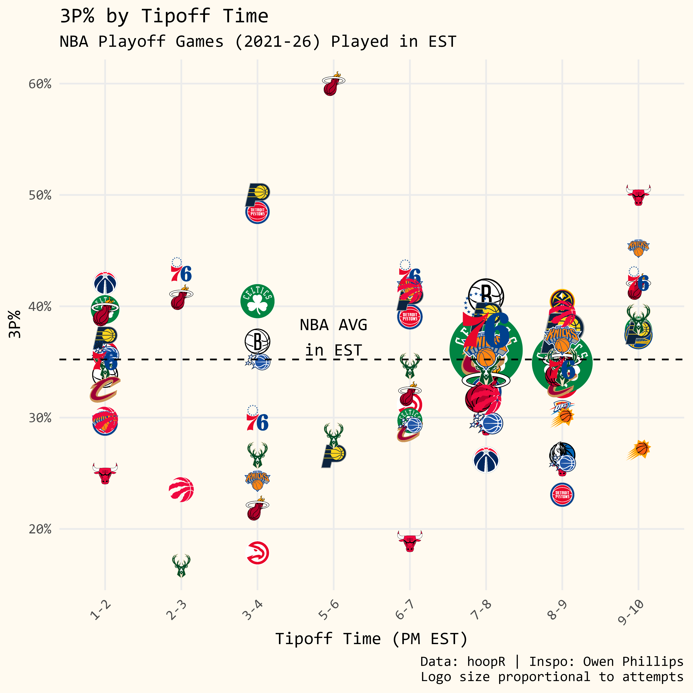
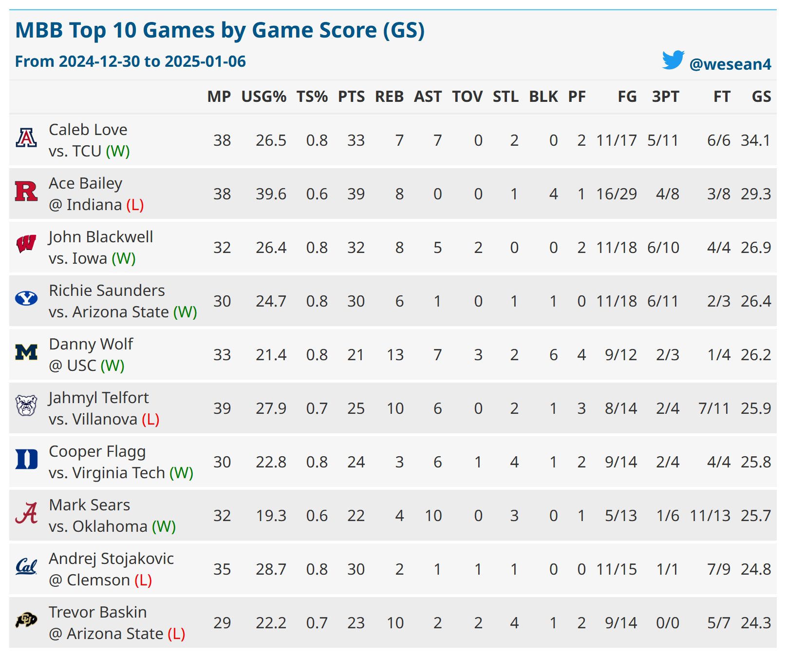
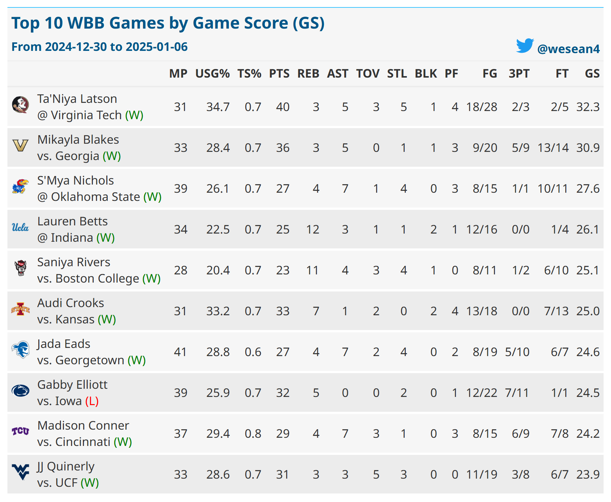

This repo stores my code and plots for sports-related plots, grouped by sport. 

Within each sport, the projects are listed in reverse chronological order, along with this README containing the full list of visualizations. A skipped number corresponds to an idea that I did not end up finishing.

# NBA

## 2. Playoff 3P% by Tipoff Time 

Other time zones here: 

[CT](NBA/02-Playoff 3P% By Tipoff Time/CT.png)

[MT](NBA/02-Playoff 3P% By Tipoff Time/MT.png)

[PT](NBA/02-Playoff 3P% By Tipoff Time/PT.png)

# NCAA Basketball

## 1. Game Score

